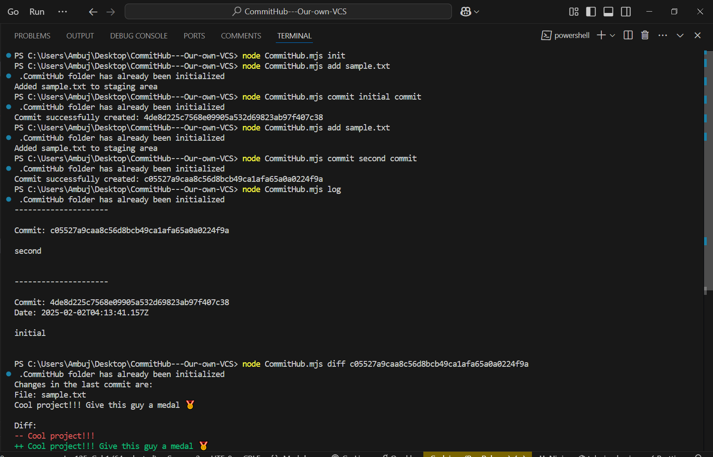

# CommitHub

CommitHub is a lightweight version control system similar to Git, built with Node.js. It allows users to track file changes, view commit history, and see differences between commits.

## Features

- Initialize a repository (`.CommitHub` directory)
- Add files to the staging area
- Create commits with messages
- View commit history (log)
- Show differences between commits (diff)

## Demo Screenshot



## Usage

### Initialize a Repository

```sh
node CommitHub.mjs init
```

This creates a `.CommitHub` directory in the current folder.

### Add a File to Staging Area

```sh
node CommitHub.mjs add <file>
```

Example:

```sh
node CommitHub.mjs add sample.txt
```

### Commit Staged Files

```sh
node CommitHub.mjs commit "Your commit message"
```

Example:

```sh
node CommitHub.mjs commit "Initial commit"
```

### View Commit History

```sh
node CommitHub.mjs log
```

### Show Differences Between Commits

```sh
node CommitHub.mjs diff <commitHash>
```

Example:

```sh
node CommitHub.mjs diff 98c4dd98766fa513434298bdb0f3a2568be6e262
```

## How It Works

- **Initialization (`init`)**: Creates a `.CommitHub` folder with necessary files (`objects`, `HEAD`, `index`).
- **Adding (`add`)**: Saves a copy of the file content in `.CommitHub/objects` and records it in the index.
- **Committing (`commit`)**: Captures the staged files into a commit and updates the HEAD reference.
- **Logging (`log`)**: Displays commit history with timestamps and messages.
- **Diffing (`diff`)**: Shows differences between a commit and its parent.

## Project Structure

```
CommitHub/
│── CommitHub.mjs     # Main CLI file
│── package.json      # Dependencies
│── .CommitHub/       # Version control storage
│   ├── objects/      # Stores file contents
│   ├── HEAD          # Stores the latest commit hash
│   ├── index         # Tracks staged files
```

## Contributing

Contributions are welcome! Feel free to fork this repository, make improvements, and submit a pull request.

## License

This project is licensed under the MIT License.

## Contact

For any issues or feature requests, open an issue on GitHub.
